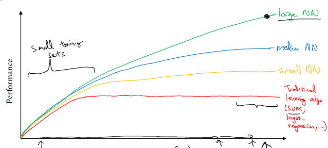
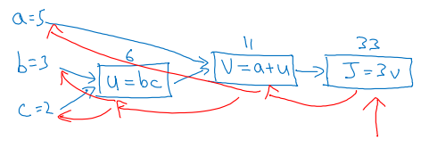

# Course 1: Neural Network and Deep Learning

## week 1: Introduction to Deep Learning

* 机器学习的数据分为: _结构化数据 (structured data)_ 与 _非结构化数据(unstructured data)_. 非结构化数据包括: 音频, 图片, 文本等
* 深度学习大爆炸的原因是:
    1. 大数据时代, 数据的爆发式增长
    2. 计算机硬件技术的发展, 计算成本下降, 速度提高
    3. 新算法的发明

## week 2: Neural Networks Basics

* 不同于一般机器学习或深度学习的书籍/教程, 吴恩达的矩阵表示法: **用列向量表示一个样本**, 因此 `X.shape==(n_x, m)`, n_x 是特征数, m 是样本大小
* `损失函数, loss` 是单个样本的估计值与真实值的误差; `成本函数, cost` 是所有样本的误差总和
* 对率回归的损失函数: $-[ylog(y_hat) + (1-y)(log(1-y_hat))]$
* 导数的定义, 极限原理
* 一个辅助工具: `计算图 Computation Graph` (和 Tensorflow 中的概念差不多) 是一个有向图, `边 edge` 定义了数据流动的方向, `节点 node`表示`运算操作 operation`, 流通的是数据.

* 上图中, 红线表示反向传播
* 神经网络步骤拆解: `参数初始化` -> `前向传播` -> `计算成本` -> `反向传播` -> `更新参数`
* 向量化的一个好处是: 不必显式地循环, 用矩阵运算来代替循环. 充分利用了 `SIMD, 单指令多数据` 的优势, 提高计算效率
* 神经网络编程指南 1: 尽可能避免显式的 for-loops
* Python 科学计算的`广播 broadcasting`: (m, n) 维的矩阵 +-*/ (1, n) 或 (m, 1) 维的矩阵, 后者将自动进行横向或纵向复制, 得到 (m, n) 维的矩阵, 然后计算
* `np.random.randn(n).shape  # (n,)` 得到一个秩为 n 的数组, 既不是行向量也不是列向量; `np.random.randn((n, 1)).shape  # (n, 1)` 得到一个 (n, 1) 维的的列向量

## week 3: Shallo Neural Networks

* 一个神经元可以看作是两步计算的结合: 1. 输入的线性加权 `z = w.T x + b`; 2. 非线性变换 `a = g(z)`
* 几个激活函数: sigmoid, tanh, ReLU, leaky ReLU

* `激活函数 activation function` 的必要性: 如果没有激活函数, 或令 g(z)=z, 无论神经网络规模变得多大, 训练得到的模型都可以表示为一个线性模型: `w'x + b`, 就无法学习复杂的特征.
* simoid func 的微分: `g'(z) = g(z)(1 - g(z))`
* tanh func 的微分: `g'(z) = 1 - g(z)^2`
* relu func 的微分: `g'(z) = 0 if z < 0; 1 if z >= 0`
* leaky relu func 的微分: `g'(z) = k if z < 0; 1 if z >= 0`
* `随机初始化的必要性`: 初始化权值为 0, 将引入`对称问题 symmetry problem`. 后果是: 第一隐层的每个神经元进行相同的计算, 输出同一结果, 以致于经过多次迭代, 第一隐层的神经元计算结果仍然相同.

## week 4: Deep Neural Networks

* 确保深度神经网络正常运行的一个方法是: 检查矩阵的维度:

* 深度神经网络更关注隐层的数量, 而不是神经元的数量. L 层的_小型_深度神经网络可能比拥有大量隐层单元的浅度网络, 拥有更好的性能. 例如下图所示的例子, 要计算 n 个特征的异或, 深度神经网络时间复杂度为 O(log(n)), 而单隐层神经网络, 时间复杂度为 O(2^n).

* 深度神经网络, 从第一隐层到输出层, 逐层学习更复杂的特征, 比如人脸识别 (语音识别), 第一隐层用于学习面部的线条 (低级音频特征), 第二层用于学习五官特征 (音素, phoneme), 第三层用于学习面部整体特征 (单词, 词组, 句子).

* 第 l 层的前向传播计算, 输入 a[l-1], 输出 a[l], 并缓存 z[l], w[l], b[l] (用于反向传播); 第 l 层的反向传播计算, 输入 da[l], 输出 da[l-1], dW[l], db[l]

* 机器学习/深度学习的基本流程:

