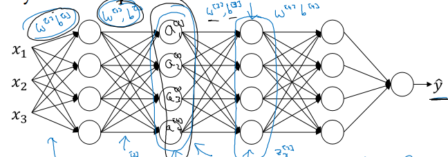

# Course 2, week 3: Hyperparameter Tuning & Batch Normalization & Programming Frameworks

* 传统机器学习调节超参数时可能会使用`网格搜索 grid search` 来选择最优超参数, 但对深度学习, 网格搜索的意义不大, 更通常的做法是随机选择超参数值, 然后`由粗到细 coarse to fine`, 重复随机选择超参数.
* 所谓`随机选择`, 并不是都采取均匀随机采样. 比如, 对于均匀分布的变量, 可以随机采样; 对于非均匀分布, 比如梯度下降学习率 $\alpha$ 的范围是 [0.0001, 1], 比较正确的做法是, 在 (0.0001, 0.001, 0.01, 0.1, 1) 附近进行随机采样, 具体的做法是: `r = -4 * np.random.rand()` $a = 10^r$ 再比如指数加权平均的超参数 $\beta$, 范围是 [0.9, 0.999], 一般也认为不是均匀分布的, 此时要利用 $1-\beta$ 构造表达式, 首先 $1-\beta$ 的范围是 [0.001, 0.1], 此时就可以用上述相同的方法进行构造: $\beta = 1 - 10^r$
* 一个经验之谈是: 偶尔 (比如每隔几个月) 重新测试超参数. 理由是, 随着数据量的增多, 过去的模型可能会过时 (stale).
* 深度学习的两种打开方式:
    1. 熊猫式 (Babysitting one model): 在计算资源有限的情况下, 难于同时训练多个模型, 因此一般精心地训练一个模型
    2. 鱼子式 (Training many models in parallel): 在计算资源充足的情况下, 可以同时训练多个模型, 最后选择最优的即可
* 我们已经知道对样本输入进行正规化 (减去样本均值, 除以样本方差) 能加速学习. `Batch Normalization` 是输入正规化的一个扩展: 对每一层的输出 a 也进行正规化. 但更通常的做法是对线性加权的结果 z 进行正规化.
* Batch Norm 的具体实现是: 在计算得 z 之后, 根据 $\mu=\Sigma \frac{z_i}{m}; \sigma ^2=\Sigma z_i - mu$ 求得 $z_{norm}$. 只进行到这一步, 每一层的 z 都具有相同的分布, 均值都是 0, 方差都是 1. 有时候我们并不希望这样, 也许不同的分布会有奇效, 也许我们就是想要不一样的分布. 因此通常还要通过 $\tilde{z_i}=\gamma z_i+ \beta$ 来调整 z 的分布. $\gamma$, $\beta$ 是模型可以学习的参数, 同 W, b 的性质一样.
* Batch Norm 有效, 可以用下图来解释. 越是靠前的层次, 对神经网络整体的影响一般越深远, 比如第一隐层的输入发生改变, 则后续的 2, 3, 4, 5 层的输入都要发生改变. 而如果只是第 4 隐层的发生改变, 影响的只是输出层而已. 对下图而言, 先不看输入层与第一隐层, 如果以第二隐层作为输入, 我们已经学好了 W3, b3, W4, b4, W5, b5, 对服从某一分布的输入, 能做出高精度的预测了. 现在重新考虑输入层与第一隐层, 这两层的加入, 会改变第二隐层的输入数据的分布, 后续所有层都不得不以较剧烈的幅度重新学习参数, 相当于重新训练了整个神经网络. 而 `Batch Norm` 增强了神经网络的`鲁棒性 Robustness`, 就是说, 对第一隐层输出的正规化, 使得第二隐层输入的数据分布保持在一个较稳定的状态, 如果第二隐层已经学好了参数, 现在只需微调甚至不需要调整. 后续各层同样如此.

* 总结一下 Batch Norm 的作用就是: `限制了靠前层次的参数更新对后续层次输入分布的影响, 从而减小了后续层次输入值的变化, 使得后续层次更稳定. 这使得, 前面的层次持续学习, 但后续层次不得不应变的可能性减小了, 也就是说, 解偶了各层次, 或者说弱化了各层参数之间的联系. 于是, 神经网络的各层可以相对独立地进行学习, 对其他层的依赖大大减小了, 加速了整个神经网络的学习`.

* 如上所述, Batch Norm 的一个副作用是, 提高了神经网络的复用性.
* Batch Norm 的其他注意点:
    - 每个 mini-batch 要独立计算均值与方差, 然后缩放
    - 对于每个 mini-batch, batch norm 会给 z 值引入噪音 (类似地, dropout regularization 会给每个隐层的 a 引入噪音)
    - Batch Norm 有轻微的正则化效果
* 测试时, 我们每次用一个测试样本来计算误差, 无法像训练时那样拥有一个 minibatch, 然后对 minibatch 计算均值/方差. 典型的做法是, 训练时, 记录每一个 minibatch 在每一层的均值/方差, 如 $mu^{\left\{1\right\}[l]}, (\sigma^2) ^{\left\{1\right\}[l]}$, 再计算 $\mu$ 与 $\sigma^2$ 各自的指数加权平均, 作为测试用的 $\mu$ 与$\sigma^2$. 至于 $\gamma$ 与 $\beta$, 如前所述, 是同 W, b 一样的参数, 直接用训练习得的即可.
* 选择深度学习框架的几点建议:
    - 易于编程 (包括开发和部署)
    - 运行速度快
    - 真开放 (开源, 且拥有良好的管理. 那些目前开源, 但缺乏管理, 未来可能被闭源的不算真开放)
