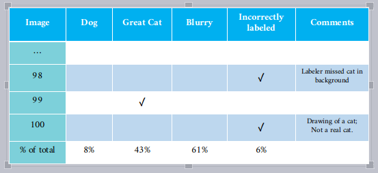

## week2: Machine Learning Strategy 2

* 深度学习对于训练集的随机误差有相当强的鲁棒性
* `误差分析 Error Analysis` 就是分析错误, 找出原因. 一种方法是表格分析法: 比如分类任务, 选择一定数量的误分类样本, 列出一系列误分类的原因, 然后统计分析, 找出主要原因, 或定位易解决的原因. 下图是表格分析的一个例子

* 要处理误标记的问题, 应同时处理验证集与测试集的误标记样本, 确保同分布. 不仅误标记处理, 任何对验证集的处理, 都应以相同的方式再处理测试集.
* 必要时候, 可以对正确分类的数据也进行分析 (也许存在错错得对的情况也说不定)
* 观察验证样本, 思考如何改进. 比如猫的分类器, 当考虑是否有必要更好地处理狗以获得更好的性能时, 就可以取一定数量的误分类的验证集样本, 统计狗的数量, 然后决定是否要实现对狗的强化识别.
* 上述的表格分析法, 实际上就能让我们同时考虑多个方法.
* 要进行深度学习, 要做的第一件事情是: `快速构建第一个系统, 然后迭代`, 验证想法, 早发现早治疗.
* 当训练集与 (验证集, 测试集) 具有不同的数据分布时, 混合所有样本随机洗牌划分数据集是错误的处理方式. 正确的处理方式是, 从同分步的验证集, 测试集中取出部分样本加入训练集. 很多时候, 海量的训练数据是容易获得的, 而验证测试数据是稀缺的.
* 还有一种数据划分方式是, 从训练集中划出少量样本作为 training-dev set, 其与训练集同分布, 但不用于训练. 此时, train set error 与 training-dev set error 之间的差距称为方差, training-dev set error 与 dev error 之间称为 `数据不匹配 data mismatch`, dev error 与 test error 称为`验证集的过拟合程度 degree of overfitting to dev set`
* 解决数据不匹配问题的几种方法:
    - 手动分析误差, 理解训练集与验证/测试集的差异
    - 使训练数据更接近验证/测试数据; 或者收集更多与验证/测试数据相似的数据加入训练集. 一种可用的技术手段是: `人工数据合成 artificial data synthesis`. 比如对于语音识别, 将人声与噪声进行合成, 得到较真实的现实场景的声音数据. 这时会带来的一个问题是, 如果使用同一份噪音, 可能会造成过拟合, 因为噪声也被当作了有价值的特征.
* `迁移学习 transfer learning`, 简而言之就是将从某一学习过程得到的知识应用到新的领域. 目前这要求, 任务是相近的. 比如放射诊断只有不多的数据, 对于训练一个高准确率的深度神经网络远远不够, 这时就可以借用一个训练好的图片识别深度神经网络的大部分层次, 只替换掉接近输出层的部分层次, 之后通过简单训练, 就得到了放射诊断的深度神经网络. 这就是迁移学习, 它将图片识别的知识迁移到了放射诊断, 理论依据是, 图片识别与放射诊断的低层特征是相似的, 比如线条的特征, 这就是两个学习任务共同的知识. 如下图所示:

* 上面提到, 迁移学习目前的要求是, 学习任务是相近的, 知识是相通的. 可以把图片识别的知识迁移到放射诊断, 但不能迁移到语音识别.
* 迁移学习另一个比较硬性的要求是, 大训练集训练得的知识可以迁移到小训练集的学习任务. 但反之被认为是不可取的, 一来这样的知识不可靠, 二来没有太大意义.
* 总结一下迁移学习的一些前提条件:
    - 任务 A, B 具有相同的输入
    - 要将任务 A 习得的知识迁移到任务 B, 要求任务 A 的数据量大于 B
    - A 的低层特征对学习任务 B 有帮助
* `多任务学习 Multi-task learning`, 简而言之就是在一个训练任务中, 同时学习多种经验. 以自动驾驶为例, 车辆需要识别行人, 其他车辆, 交通标志, 信号灯等, 从包含以上多个目标的图片中进行识别训练, 那么同一个训练过程, 就需要识别出多个物体. 每个物体的识别, 都是一项学习任务, 因此, 同时识别多个物体就属于 `多任务学习` 了.
* 多任务学习的样本输出值是一个 (n, 1) 维向量, 其中 n 是学习任务数. 假设以 0-1 标记图片中各物体出现与否, 多任务学习的输出有点类似 one-hot 向量. 但不同于 one-hot 向量有且仅有且必须有一个元素被标记为 1, 多任务学习的输出向量可以认为就是单任务学习的输出的组合, 每个位置上的输出值都表示图片中是否存在对应物体. 这就要求图片的标签, 即 y 也是一个 (n, 1) 维向量. 相应地, 多任务学习的`损失函数 Loss` 也是一个向量
* 有时候, 多任务学习的样本标签带有一些问题标记, 通常用 ? 表示. 只要不是全是问题标记的情况, 该样本依旧可以用于训练, 只是最后处理的时候忽略该项, 或采用其他技术手段即可. 而如果直接丢弃该样本, 那对于现实生活中存在的大量信息缺失情形, 可用于训练的数据将大大减少, 因此要不抛弃不放弃.
* 总结一下多任务学习的一些前提条件:
    - 学习的一系列任务, 都能从共享的低层特征中收益. 比如图片中多物体的识别, 低层特征如线条就是共享的, 所有的物体识别都能从中获益. 此处有一个推论, 就是得益于特征共享, 多任务学习的性能会比独立训练多个单任务神经网络更好.
    - 通常, 各学习任务的数据量是相近的. 以自动驾驶为例, 要学习识别行人, 车辆, 交通标志, 信号灯, 那么, 能够识别出行人, 车辆, 交通标志, 信号灯的样本数量应该是相近的. 一个直观的感觉是, 有 1000000 个样本, 其中 999000 能识别出车辆, 只有 1000 样本能识别出行人, 那么行人不是更像噪声吗
    - 多任务学习的一个假设是: 只要训练一个足够大的神经网络, 就能在各项任务上都有足够好的性能
* `端到端学习 end to end learning`, 简而言之就是没有中间过程, 从输入直接到输出. 以语音识别为例, 传统的做法是, 1) 从音频中提取特征; 2) 从特征中提炼音素; 3) 构词; 4) 转录成文本. 而端到端学习, 就是简单粗暴的从音频到转录文本. 如下所示:

* 端到端学习的优缺点:
    - 优点:
        - 让数据发声
        - 只需要更少的人工参与
    - 缺点:
        - 可能需要大量的数据, 大到足以让数据发声
        - 剔除了潜在的有帮助的人工参与
* 人工参与到机器学习/深度学习的各环节, 可以将人的经验, 知识等注入系统, 也许能帮助系统更好更快的学习. 此外, 将端到端学习拆分成多个相对独立的学习过程, 有点分治的味道, 易于实现, 性能也可能比设计不佳的端到端学习更好.
